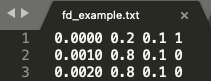

# Frequently Asked Questions (FAQ)

We believe JAX is an exciting tool for scientific simulations. The phase-field simulation is just an example and the beginning of this area. Here are our reasons:

1. You program in Python, and the code runs on ___CPU/GPU___ as fast as compiled languages (C/Fortran). Efficient for both human developers and machines!
2. It is natural for research of the flavor of ___AI for science/engineering___, because JAX is intended for high performance machine learning.
3. The automatic differentiation feature of JAX opens the door for ___design and optimization___ because gradients are now available on the fly.

The idea is __open code = better science__, and this is how we try to contribute to the scientific computing (with a focus on computational mechanics) community. 

 

### Q: What are the dependencies of this code?

You need to install  [JAX](https://github.com/google/jax). We highly encourage you to create a `conda` environment and install all Python packages in the environment. Although JAX works with CPU, its true power is on GPU. You may expect a boost of performance for 10x to 100x on GPU than CPU.

Another major tool we use is [Neper](https://neper.info/) for polycrystal structure generation. Neper is a CPU intensive software.  


### Q: What are the source files and how are they intended for?

For developers, the key file for computation is `allen_cahn.py` , where we solve the phase-field equations. Almost everything interesting happens in this file. The parameters are defined in `arguments.py`, though. Utility functions and post-processing functions are defined in `utils.py`. 

For users, there are several example files, such as `example.py` and `solidification.py`.


### Q: What are the units used in the simulation?

We use SI units for all quantities except for length, which is in [mm].


### Q: How do I run an example?

We use [module run](https://stackoverflow.com/questions/7610001/what-is-the-purpose-of-the-m-switch) to execute a certain script. For instance, to run  `src/example.py`, under `/polycrystal` and specify in command line the following

```
python -m src.example 
```


### Q: How do I specify laser path?

You specify laser path with txt files. For example, in this  `data/txt/fd_example.txt`  example file, we have

<p align="middle">
  
</p>

The four columns are time, x position, y position, and laser switch. In this file, we turn the laser on at t=0 [s], x=0.2 [mm], y=0.1 [mm], turn the laser off at t=0.001 [s], x=0.8, [mm], y=0.1 [mm], and finally keep the laser off at t=0.002 [s], x=0.8, [mm] y=0.1 [mm]. In between those time stamps, laser is assumed to travel with a constant speed.


### Q: I got an error of "certain directory does not exist".

Just create a directory manually. We didn't track the data folder on GitHub, so you would have to create the data folder by yourself on your local machine. For example, what appears on my local machine is 

<p align="middle">
  
</p>

As you can see, we sort the data files according to their types. 

