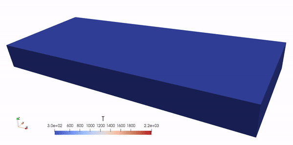
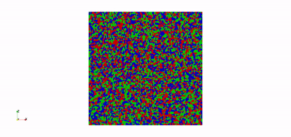
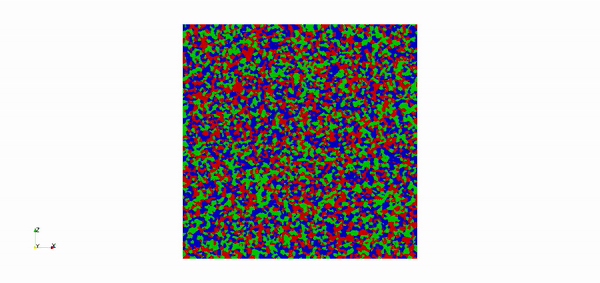

# Phase-field simulation of microstructure evolution in additive manufacturing

This is the repository for our paper "[Physics-embedded graph network for accelerating phase-field simulation of microstructure evolution in additive manufacturing](https://doi.org/10.1038/s41524-022-00890-9)" on _npj Computational Materials - Nature_. We implemented both classic direct numerical simulation (DNS) based on the finite difference method and a new physics-embedded graph network (PEGN) approach. PEGN is a computationally light alternative for DNS. The code runs on both CPU and GPU. The DNS approach generally follows [Yang et al](https://www.nature.com/articles/s41524-021-00524-6). This code is developed under [AMPL](https://www.cao.mech.northwestern.edu/) at Northwestern University. 

## Requirements 

We use [JAX](https://github.com/google/jax) for implementation of the computationally intensive part. The graph construction is based on [Jraph](https://github.com/deepmind/jraph). The polycrystal structure is generated with [Neper](https://neper.info/). 

## Descriptions

The typical workflow contains two major steps:
1. Generate a polycrystal structure and mesh it (with Neper)
2. Perform phase-field simulation.

The file  `src/example.py` is an instructive example. To run this file, under root directory and run

```
python -m src.example
```

Please see the comments in  `src/example.py` for further details. We also have [an instruction file](https://github.com/tianjuxue/polycrystal/blob/main/Instructions.md) for FAQs.

## Case studies 

__Single-layer single-track powder bed fusion process__

The left column shows results of DNS, while the right column shows results of PEGN. The first row shows temperature field, the second row is melt pool, and the the third row is grain evolution.

<p align="middle">
  
   
</p>


<p align="middle">
  
   
</p>

<p align="middle">
  
   
</p>

__Multi-layer multi-track powder bed fusion process__

Below is the result of using PEGN for simulating a 20-layer process.

<p align="middle">
  
  
</p>

__Directional solidification__

Competitive grain growth is observed if grain anisotropy is considered. Left is when grain anisotropy is NOT included, and right is when it is included. Competitiveness: red > blue > green for anisotropic case. The result is based on DNS.


<p align="middle">
  
   
</p>
